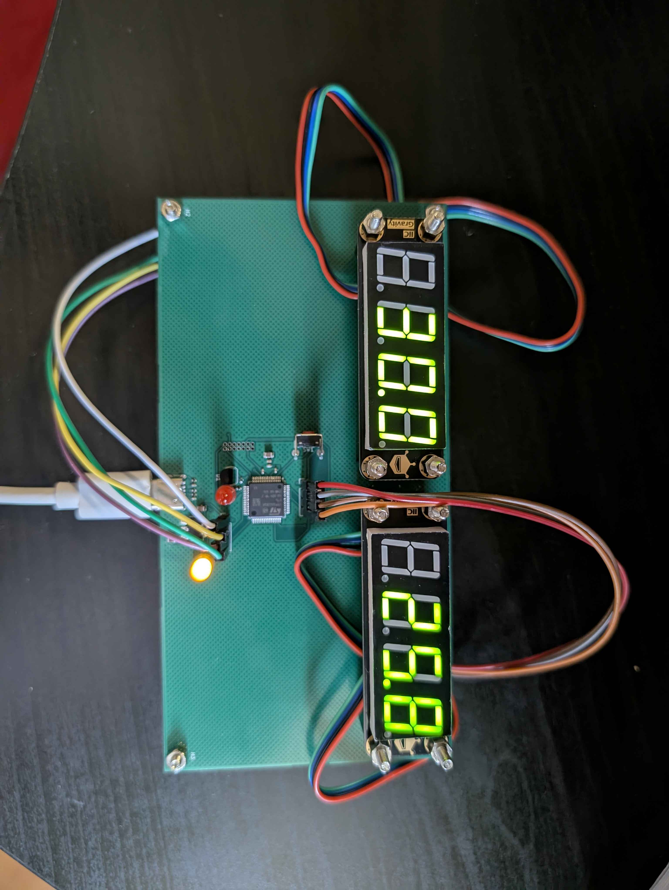

# 🔥 Fire Alarm — Temperature Sensor Alarm System

> **CMPE2700 — PCB Design Project**
> STM32G0B1RETx · DS18B20 · DFRobot Gravity 7-Segment Displays · USB-C Powered

---

## Overview

A temperature monitoring and alarm system built on a custom PCB. The DS18B20 sensor continuously reads ambient temperature and displays it on a 4-digit 7-segment display. When the temperature exceeds a configurable threshold, an alarm LED activates. The alarm must be manually acknowledged by pressing the onboard button.

A second 7-segment display shows the current alarm threshold for reference at all times.

---

## Hardware

| Component | Description |
|---|---|
| **STM32G0B1RETx** | Main microcontroller |
| **DS18B20** | 1-Wire digital temperature sensor |
| **AMS1117-3.3** | LDO voltage regulator, steps down 5 V → 3.3 V |
| **DFRobot Gravity 4-Digit LED Display (×2)** | TM1650-based 7-segment displays over I2C |
| **USB-C Connector** | Board power input (5 V) |
| **SWD Header** | STM32 programming and debug interface |
| **Tactile Button** | Alarm acknowledge / reset |
| **External LED** | Alarm indicator |

---

## How It Works

1. The DS18B20 reads temperature every second over the 1-Wire bus
2. The current temperature is shown on **Display 1** (I2C1)
3. The alarm threshold is shown on **Display 2** (I2C2)
4. If the temperature exceeds the threshold, the **alarm LED turns on**
5. Press the **onboard button** to acknowledge and clear the alarm

---

## PCB

<!-- Replace the line below with your actual image once converted to PNG/JPG -->


> 📷 *PCB photo — upload a JPG/PNG version of the image to add it here*

### Known Hardware Issue — J1 / J2 Header Pin Swap

> ⚠️ **Workaround required — jumper wires needed**

The I2C headers J1 and J2 were routed with the following pinout:

```
PCB Header (J1/J2):   5V · GND · SDA · SCL
```

However, the mating female connectors on the DFRobot Gravity displays use:

```
Display Connector:    5V · GND · SCL · SDA
```

The **SDA and SCL lines are swapped** between the PCB header and the display connector. As a result, the displays cannot be plugged in directly — they will not communicate.

**Fix:** Use jumper wires to cross SDA and SCL between the header and the display connector before plugging in.

This will be corrected in the next PCB revision by swapping the SDA/SCL positions on J1 and J2 in the schematic.

---

## Firmware

The firmware is written in C using the STM32 HAL library and structured across three STM32CubeIDE projects:

| Project | Description |
|---|---|
| `Temperature sensor/` | DS18B20 driver development and test |
| `SevenSeg/` | TM1650 7-segment display driver development and test |
| `Temperature alert system/` | Final integrated alarm application |

### Firmware Repository Structure

```
Firmware/
├── Temperature sensor/         # DS18B20 test project
├── SevenSeg/                   # 7-segment display test project
└── Temperature alert system/   # Final alarm application
Hardware/
├── PCB_Final.kicad_pcb         # PCB layout
├── PCB_Final.kicad_sch         # Schematic
└── PCB_Final.kicad_pro         # KiCad project file
```

---

## Programming the STM32

1. Connect an ST-Link programmer to the **SWD header** on the PCB
2. Power the board via **USB-C**
3. Open the project in **STM32CubeIDE**
4. Build and flash using **Run → Debug** or **Run → Run**

---

## Pin Assignments

| Signal | STM32 Pin | Notes |
|---|---|---|
| 1-Wire Data | PA (one_wire_data) | DS18B20 with 4.7 kΩ pull-up |
| I2C1 SDA/SCL | I2C1 | Display 1 — current temperature |
| I2C2 SDA/SCL | I2C2 | Display 2 — alarm threshold |
| Alarm LED | PA (ext_led) | Active high |
| Button (B1) | PC13 | Active low, internal pull-up |
| Green LED | PA5 | Onboard status/heartbeat |
| USART2 TX/RX | PA2 / PA3 | Debug output at 115200 baud |

---

## Author

**Aldrich Dias** — CMPE2700, 2026
